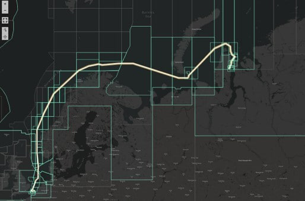

# Charts analyser service

Разработать сервис для мониторинга и анализа трэков судов и их соответствия
границам морских карт.

## Функциональность сервиса, API

### Роль судно:
 
- идентификация судна, отправляющего трек, через токен
- запись трека от судна (координаты, дата) `POST /api/track/`,

### Роль оператор:
- аутентификация `POST /api/login`, дальнейшая авторизация через токен
- список морских карт, которые пересекались заданными в запросе судами в заданный временной промежуток. `POST /api/chart/vessels`  
  Входные параметры: идентификаторы судов, стартовая дата, конечная дата.
- список судов, которые пересекали заданные в запросе морские карты в заданный временной промежуток. `POST /api/chart/vessels`  
  Входные параметры: идентификаторы карт, стартовая дата, конечная дата.
- Режим мониторинга судов в реальном времени:
  - поставить (снять) на мониторинг судно. `POST (DELETE) /api/monitor`
  - список судов, поставленных на мониторинг. `GET /api/monitor`
  - Детальная информация по судам на мониторинге: `POST /api/monitor/state`, кроме основной, должна содержать:
    - ID карты, которую судно пересекает в данный момент.
    - Время входа в текущую зону
    - Время, проведенное судном на мониторинге в текущей зоне (карте). Время
    отсчитывается с момента последнего пересечения границы зоны судном (момент
    входа в зону).
- добавление судов `POST /api/vessels`
- изменение судов `PUT /api/vessels`
- удаление судов (soft delete) `DELETE /api/vessels`
 
### Примечания:
  - Морские карты (зоны) задаются полигонами с произвольным число вершин обозначенными географическими координатами.
  - Считается, что судно пересекало карту, если хотя бы одна точка его маршрута
  находится в пределах полигона, описывающего карту.

### Ограничения

- Сервис должен работать в следующих географических координатах:
  - min_longitude = -180.0
  - max_longitude = 180.0
  - min_latitude = -75.0
  - max_latitude = 75.0
- Количество судов на мониторинге неограниченно.
- Предполагается, что для судов на мониторинге их статус будет запрашиваться раз
1 в 1 - 5 секунды.

## Симулятор

- Симулятор потока реальных данных, который базируется на предоставленных
исторических данных.[^1]

## Импорт данных

- Коллекция полигонов, описывающих морские карты: `geo_zones.json`  
  Массив из объектов карт:
  - уникальный идентификатор карты/зоны `zone_XX`,
  - Полигон, описывающий границы карты. `[[lon1,lat1],[lon2,lat2],[lon3,lat3]...]`
- Коллекция навигационных данных судов: `tracks/*.csv` с заголовками:  
  `timestamp`,`longitude`,`latitude`,`vessel_id`,`vessel_name`  
  Одна точка трэка/маршрута судна характеризуется:
  - `timestamp` - UTC timestamp,
  - `vessel_id` - уникальный идентификатор судна,
  - `vessel_name` - имя судна,
  - `latitude` (deg) - позиция судна на момент timestamp: широта,
  - `longitude` (deg) - позиция судна на момент timestamp: долгота.

### Реализация

- Сервис может быть представлен как набор docker-контейнеров. Система
конфигурирования - Docker Compose.

[^1]: Простейший пример: данные за один день из прошлого каждый новый день
используются для симуляции данных текущего дня.
